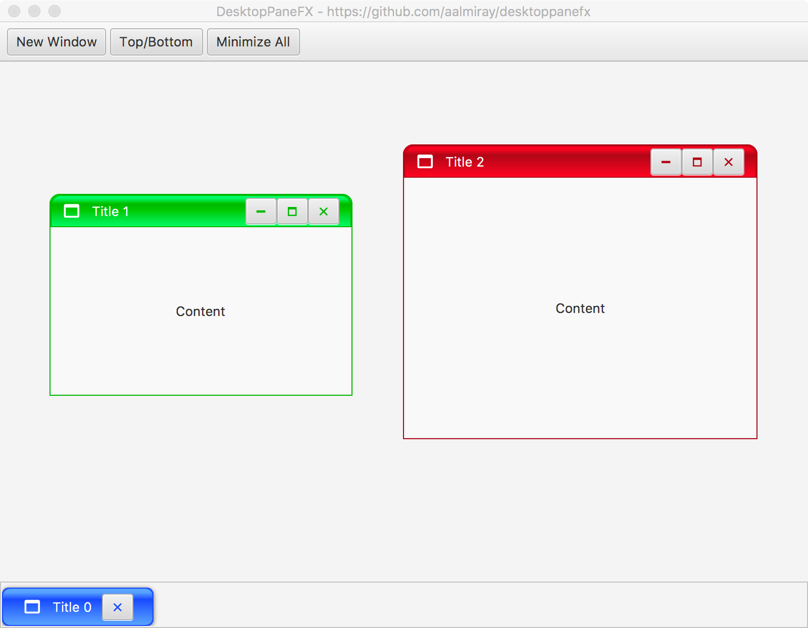

= DesktopPaneFX
:linkattrs:
:project-owner:   aalmiray
:project-repo:    kordamp
:project-name:    desktoppanefx
:project-group:   org.kordamp.desktoppanefx
:project-version: 0.6.0

image:http://img.shields.io/travis/aalmiray/{project-name}/master.svg["Build Status (travis)", link="https://travis-ci.org/aalmiray/{project-name}"]
image:http://img.shields.io/badge/license-ASL2-blue.svg["ASL2 Licensed", link="http://opensource.org/licenses/ASL2"]
image:https://api.bintray.com/packages/{project-owner}/{project-repo}/{project-name}/images/download.svg[link="https://bintray.com/{project-owner}/{project-repo}/{project-name}/_latestVersion"]
image:https://img.shields.io/maven-central/v/{project-group}/{project-name}-core.svg?label=maven[link="https://search.maven.org/#search|ga|1|{project-group}"]
image:https://img.shields.io/badge/donations-Patreon-orange.svg[link="https://www.patreon.com/user?u=6609318"]

---

JDesktopPaneFX is a JavaFX version of Swing's JDesktopPane which can be used as a container for individual "child" similar to JInternalFrames.

This project started as a fork of link:https://github.com/lincolnminto/javaFXMDI[JavaFXMDI] authored by Lincoln Minto.

== Installing

You can get the latest version of **DesktopPaneFX** directly from link:https://bintray.com[Bintray's JCenter] repository
or from Maven Central.

.Maven
[source]
[subs="verbatim,attributes"]
----
<dependency>
    <group>{project-group}</group>
    <artifactId>{project-name}-core</artifactId>
    <version>{project-version}</version>
</dependency>
----

.Gradle

[source]
[subs="verbatim,attributes"]
----
compile '{project-group}:{project-name}-core:{project-version}'
----

== Example

[source]
----
import javafx.application.Application;
import javafx.scene.Scene;
import javafx.scene.control.Button;
import javafx.scene.control.Label;
import javafx.scene.layout.BorderPane;
import javafx.stage.Stage;
import org.kordamp.desktoppanefx.scene.layout.DesktopPane;
import org.kordamp.desktoppanefx.scene.layout.InternalWindow;
import org.kordamp.ikonli.javafx.FontIcon;

public class Example extends Application {
    private static int count = 0;

    @Override
    public void start(Stage stage) throws Exception {
        DesktopPane desktopPane = new DesktopPane();
        Button newWindow = new Button("New Window");
        newWindow.setOnAction(e -> {
            InternalWindow window = new InternalWindow(
                "window-" + count,
                new FontIcon("mdi-application:20"),
                "Title " + count++,
                new Label("Content"));
            desktopPane.addInternalWindow(window);
        });

        BorderPane mainPane = new BorderPane();
        mainPane.setPrefSize(800, 600);
        mainPane.setTop(newWindow);
        mainPane.setCenter(desktopPane);

        stage.setScene(new Scene(mainPane));
        stage.show();
    }
}
----

== Building

You must meet the following requirements:

 * JDK8u40 as a minimum
 * Gradle 4.7

You may used the included gradle wrapper script if you don't have `gradle` installed.

=== Installing Gradle

.Manual

 . Download Gradle from http://gradle.org/downloads
 . Unzip the file into a directory without spaces (recommended).
 . Create a GRADLE_HOME environment variable that points to this directory.
 . Adjust your PATH environment variable to include $GRADLE_HOME/bin (%GRADLE_HOME%\bin on Windows).
 . Test your setup by invoking `gradle --version`.

.SDKMAN

 . Follow the instructions found at http://sdkman.io/ to install SDKMAN.
 . You need a POSIX environment if running Windows. We recommend using Babun Shell (http://babun.github.io/)
 . Once SDKMAN is installed invoke `sdk install gradle 4.7`.
 . Test your setup by invoking `gradle --version`.

.Gdub

GDub is a wrapper script that facilitates invoking gradle tasks anywhere within a Gradle project. It's smart enough
to use the gradle wrapper if available or your global gradle command. This is an optional download.

 . Follow the instructions found at https://github.com/dougborg/gdub to install gdub

=== Next Steps

Make a full build issuing `gradle build`.

Run the sampler JavaFX application by invoking the following command

[source]
----
$ cd subprojects/sampler
$ gradle run
----

=== Contributing

If you are interested in fixing issues and contributing directly to the code base, please contact us!

=== License

link:LICENSE.txt[LICENSE.txt]
